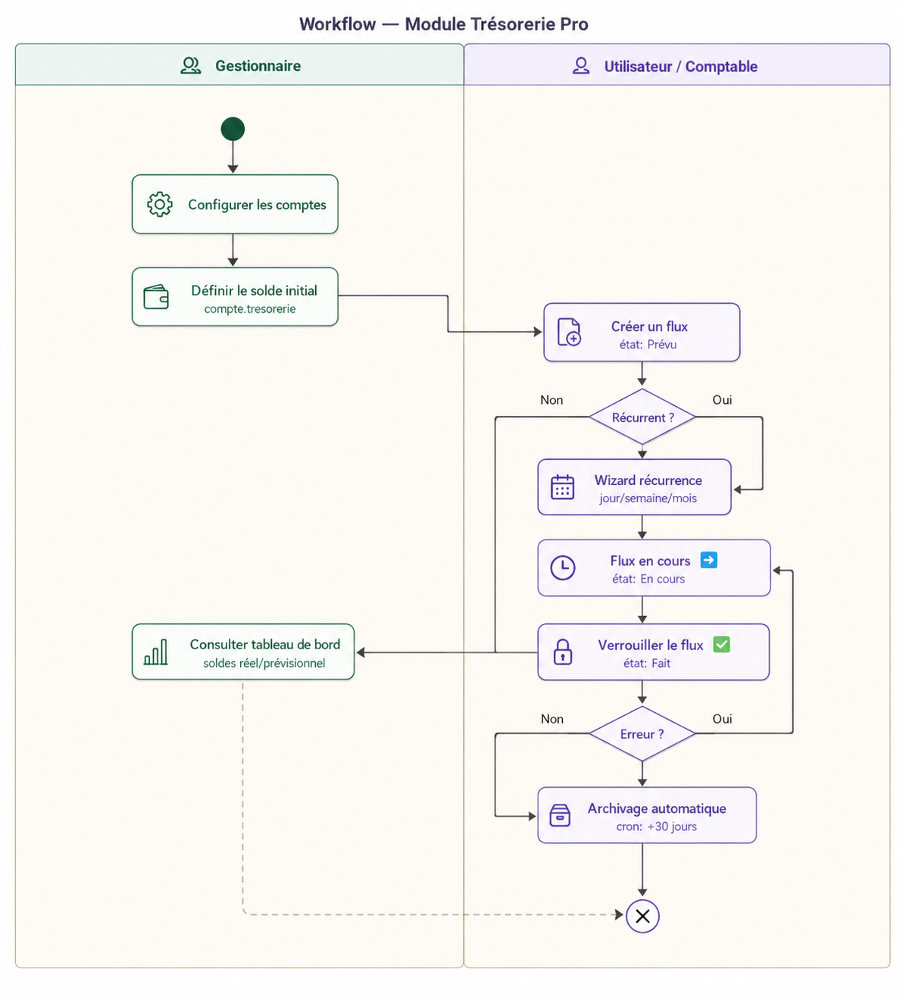

# Module Trésorerie Pro

Ce document illustre les fonctionnalités du module **Trésorerie Pro** (`tresorerie_pro`) d'Odoo 18, conçu pour la gestion prévisionnelle de la trésorerie.

## Présentation du module

Le module **Trésorerie Pro** permet de gérer et de suivre les **flux financiers prévisionnels** de l'entreprise. Il offre une vision claire des entrées et sorties de fonds attendues sur une période donnée, par compte de trésorerie (Banque, Caisse, etc.), avec un calcul automatique du solde cumulé.

## Comptes de Trésorerie

### Configuration des comptes

Avant de saisir les flux, il est nécessaire de configurer les **comptes de trésorerie** de l'entreprise. Chaque compte représente un compte bancaire ou une caisse et dispose des informations suivantes :

* **Nom du compte** — libellé du compte (ex : Banque BNA, Caisse principale).
* **Journal comptable** — journal Odoo de type Banque ou Caisse associé au compte.
* **Solde initial** — solde d'ouverture du compte en début de période.
* **Solde réel (compta)** — solde calculé automatiquement depuis les écritures comptables validées.
* **Solde prévisionnel** — solde calculé automatiquement en tenant compte de tous les flux prévisionnels enregistrés.

### Tableau de bord

Le module propose un **tableau de bord** affichant en temps réel tous les comptes de trésorerie avec leurs soldes réels et prévisionnels, permettant une vision synthétique de la situation financière de l'entreprise.

## Flux de Trésorerie

### Saisie d'un flux

Un flux de trésorerie représente une **entrée ou sortie de fonds prévue**. Chaque flux contient les informations suivantes :

* **Référence** — générée automatiquement à la création.
* **Compte** — compte de trésorerie concerné (Banque ou Caisse).
* **Partenaire** — client ou fournisseur associé au mouvement.
* **Désignation** — description du flux.
* **Date prévue** — date estimée du mouvement.
* **Date effective** — date réelle du mouvement (renseignée lors du verrouillage).
* **Entrée (+)** — montant entrant.
* **Sortie (-)** — montant sortant.
* **Balance** — calculée automatiquement : Entrée - Sortie.
* **Solde n-1** — solde cumulé avant ce flux.
* **Solde** — solde cumulé après ce flux (calculé automatiquement).

### États d'un flux

Chaque flux progresse par les états suivants :

* **Prévu** — flux planifié, en attente de réalisation.
* **En cours** ⬅️ — flux en cours de traitement.
* **Fait** ✅ — flux réalisé et verrouillé.

### Verrouillage et déverrouillage

* **Vérrouiller** — confirme que le flux a été réalisé. Le flux passe à l'état **Fait** et ne peut plus être modifié. Le flux suivant du même compte passe automatiquement à **En cours**.
* **Déverrouiller** — remet le flux à l'état **En cours** pour correction.

> ⚠️ Un flux à l'état **Fait** ne peut pas être modifié ni supprimé.

## Création de Flux Récurrents

Le module propose un **assistant (wizard)** permettant de créer des flux récurrents automatiquement, évitant la saisie manuelle répétitive.

### Options de récurrence

* **Une seule fois** — crée un seul flux à une date précise.
* **Chaque jour** — crée un flux pour chaque jour entre la date de début et la date de fin.
* **Chaque semaine** — crée un flux chaque semaine au jour choisi (Lundi, Mardi, ...).
* **Chaque mois** — crée un flux chaque mois au jour choisi (1 à 31).

### Paramètres de l'assistant

* **Désignation** — libellé commun à tous les flux générés.
* **Compte** — compte de trésorerie concerné.
* **Partenaire** — partenaire associé (optionnel).
* **Type** — Entrée (+) ou Sortie (-).
* **Montant** — montant de chaque flux.
* **Fréquence** — type de récurrence.
* **Date de début / Date de fin** — période de génération.

## Archivage automatique

Un **cron job** s'exécute automatiquement pour archiver les flux dont la date effective dépasse 30 jours, afin de garder la liste principale lisible et performante.

## Sécurité

L'accès au module est contrôlé par des groupes de sécurité :

* **Utilisateur Trésorerie** — consultation et saisie des flux.
* **Gestionnaire Trésorerie** — configuration des comptes et accès complet.

## Workflow

## Plus de détails

- Pour la facturation et les paiements, consulter le module [Facturation](./odoo-facturation.mdx).

----
[Retour au sommaire](./odoo-deploy-guidelines.mdx)

----
🔗 **Official Resource**: [Odoo Documentation](https://www.odoo.com/documentation)