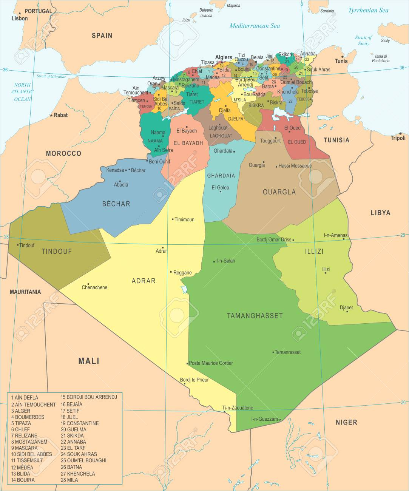

# Module Contact — Localisation Algérienne

Ce document illustre les fonctionnalités ajoutées au module **Contact** d'Odoo pour la localisation algérienne, via le module `l10n_dz_info`.

## Présentation du module

Le module `l10n_dz_info` enrichit les fiches **Contact (Partenaire)**, **Société** et **Employé** avec des données et des champs spécifiques à l'Algérie, notamment les wilayas, les communes et les identifiants fiscaux/légaux.

## Données de localisation

### Wilayas

Le module intègre la liste complète des **69 wilayas algériennes**. Ces wilayas sont disponibles comme états/régions dans Odoo et peuvent être sélectionnées sur toutes les fiches adresse.

### Communes

Le module intègre également la liste complète des **communes algériennes**, liées à leurs wilayas respectives. Sur les fiches adresse, il est possible de filtrer les communes par wilaya sélectionnée.

## Champs ajoutés

### Sur la fiche Partenaire / Client / Fournisseur

Les champs suivants sont ajoutés à la fiche partenaire :

* **Commune** — sélection de la commune liée à la wilaya choisie.
* **RC** — Registre du Commerce.
* **NIF** — Numéro d'Identification Fiscale.
* **NIS** — Numéro d'Identification Statistique.
* **AI** — Article d'Imposition.

### Sur la fiche Société

Les mêmes champs fiscaux et légaux sont disponibles sur la fiche de la **société** (RC, NIF, NIS, AI) ainsi que le champ **Commune**.

### Sur la fiche Employé

Le champ **Commune** est également disponible dans l'adresse privée de l'employé, lié à la wilaya de résidence.

## Plus de détails

- Pour la gestion des employés, consulter le module [Employés](./odoo-employee.mdx).
- Pour la facturation, consulter le module [Facturation](./odoo-facturation.mdx).

----
[Retour au sommaire](./odoo-deploy-guidelines.mdx)

----
🔗 **Official Resource**: [Odoo Documentation](https://www.odoo.com/documentation)