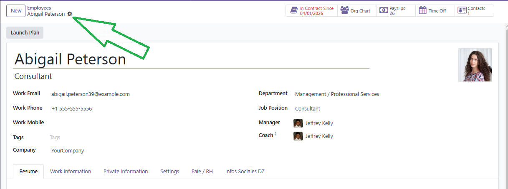
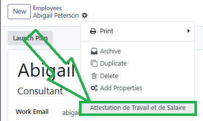
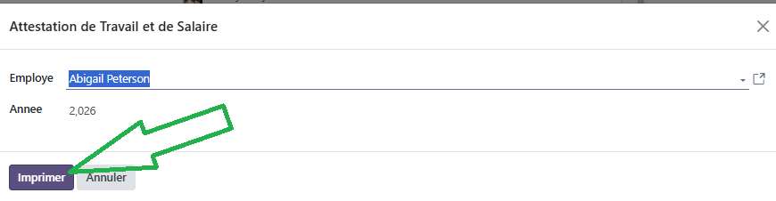

#Module Employés

Ce document illustre les différentes fonctionnalités du module **Employés** d'odoo 13 community.

## Présentation du module

Ce module est destiné à gérer efficacement les employés en centralisant toutes les informations relatives aux ressources humaines. Il permet de :

- superviser toutes les informations importantes pour chaque département.
- limiter l'accès aux informations sensibles aux responsables des ressources humaines.
- de rendre certaines informations publiques, accessible à tous les employés sous forme de répertoire du personnel par exemple.
- recevoir des alertes pour toute nouvelle demande de congés, demande d'allocation, candidature, évaluation et plus encore (en fonction des modules installés).

## Configuration (admin)

Cette section, réservée aux **administrateurs**, permet de définir les paramètres généraux du module, tel que l'organisation professionelle et les droits d'accès de l'employé à ces informations.

#### Configuration des Employés

- L'option **_Gestion des compétences_**  active de nouvelles fonctionnalités permettant aux **GRH** d'enrichir les informations des employés avec leurs expériences antérieurs et leurs compétences, tel que notées sur leurs CVs.

- L'option **_Contrôle de présence_**  active de nouvelles fonctionnalités permettant aux **GRH** de suivre les présences des employés sur la base du **module Présences** ou de leurs status d'utilisateur dans Odoo (login/logout).

- L'option **_Advanced Presence Control_** permettant aux **GRH** de suivre les présences des employés sur la base des emails envoyés ou de leurs adresses IP.

#### Organisation professionnelle

- L'option **_Heures de travail de l'entreprise_**  permet de renseigner les horaires de travail de l'entreprise.

- L'option **_Organizational Chart_**  permet d'afficher un organigramme sur la fiche employé si son gestionnaire est définis.

#### Employee Update Rights

​L'option **_Employee Edition_** donne le droits aux employés de mettre à jours leurs propres données.

### Postes occupés

Cette section, réservée aux **responsables des ressources humaines**, permet de définir les informations relatives aux postes occupés par les employés, tel que l'intitulé le département y relatif, le nombre d'employés supposés l'occupé et sa description.

### Départements

Cette section, réservée aux **responsables des ressources humaines**, permet de définir la structure et la hiérarchie de l'entreprise (directions, départments, services, ...).

D'une manière générale, un département au sens odoo est toute unité élémentaire regroupant un ensemble d'employés. Ces départements peuvent être hiérarchisés en définissant le **département parent** et un **gestionnaire** peut être définis pour chacun d'entre eux ce qui permettra de définir les responsabilités/autorités de chaque employé.

### Plans

Cette section, réservée aux **responsables des ressources humaines**, permet de définir les plans (parcours) standardisés, définis par l'entreprise, relatifs à la gestion de la ressource humaine, tel que :

- l'intégration/installation d'un employé dans un nouveau poste (OnBoarding),
- et le départ d'un employé (OffBoarding).

Le responsable des ressources humaines peut créer plusieurs plans en fonction des processus métier de l'entreprise. Pour cela, il suffit de **_créer_** un nouveau plan et de définir les activités y relatif.

Les types d'activités peuvent être définis dans la section [Configuration / Paramètres généraux / Messages / Activités](./odoo-configuration.mdx#messages).

## Emlpoyés

Cette section, réservée aux **responsables des ressources humaines**, permet de gérer les informations relatives aux employés de l'entreprise.

Les sections **_Informations professionelles_** et **_Informations personnelles_** contienent les données standards de l'employé, tel que le Lieu de travail, le mentor, les contacts, l'état civil, l'éducation, ...

La section **_Paramètres RH_** permet de **_lier_** l'employé à un utilisateur et de **_Générer_** un identifiant de badge en fonction du nom. Une fois l'identifiant du badge généré, les **responsables des ressources humaines** peuvent l'imprimer directement en format PDF.

## Annuaire des salariés

L'annuaire des salariés est disponibles à tous les **utilistateurs internes** de l'entreprise afin de faciliter l'accès aux informations essentielles tel que les contacts. Les informations personnelles et les paramètres RH des employés ne sont pas accessibles.

## Gestion des contrats

Si le composant **Contrats des Employés** est installé, les **GRH** ont la possibilité de gérer les contrats de leurs enmployés selon le pipeline suivant : **_Nouveau_**, **_En cours_**, **_Expiré_** ou **_Annulé_**.

Ainsi pour chaque employés un contrat peut être crée avec tous les renseignements nécessaires.

---
## Extension Algérienne du Module Employés (`l10n_dz_payroll`)

Le module **`l10n_dz_payroll`** étend le module standard Employés d'Odoo avec les champs requis par la réglementation algérienne en matière de paie.

---

### Informations personnelles supplémentaires (fiche employé)

La fiche employé est enrichie avec les données personnelles et administratives nécessaires au calcul de la paie DZ :

| Champ | Description |
|---|---|
| **Situation familiale** | Célibataire, Marié(e), Divorcé(e), Veuf/Veuve |
| **Nombre d'enfants à charge** | Entier, utilisé pour le calcul des déductions IRG et allocations familiales |
| **Conjoint travaille** | Si coché, la déduction conjoint IRG ne s'applique pas |
| **N° Sécurité Sociale (CNAS)** | Numéro d'affiliation CNAS de l'employé |
| **NIF** | Numéro d'Identification Fiscale |
| **Direction** | Direction ou département d'affectation |
| **Taux IRG spécifique (%)** | Taux fixe optionnel — remplace le barème progressif si renseigné |

> **Note :** Si le champ **Taux IRG spécifique** est renseigné, le calcul de l'impôt utilisera ce taux forfaitaire au lieu du barème progressif par tranches.

---

### Extension du contrat de travail

Le contrat de travail est également étendu avec de nombreux champs propres à la législation algérienne, regroupés en trois catégories selon leur traitement fiscal et social.

#### Identification du salarié

| Champ | Description |
|---|---|
| **Matricule** | Numéro matricule interne de l'employé |
| **N° CNAS** | Numéro d'affiliation CNAS (contrat) |
| **N° Compte Bancaire / CCP** | Coordonnées bancaires pour virement du salaire |

#### Classification professionnelle

| Champ | Description |
|---|---|
| **Grade** | Grade du salarié |
| **Catégorie Professionnelle** | Ex : Cadre, Agent de maîtrise, Ouvrier qualifié... |
| **Poste occupé** | Intitulé du poste |
| **Salaire de poste (DA)** | Salaire de base afférent au poste occupé |

#### Paramètres de calcul

| Champ | Description |
|---|---|
| **Date de recrutement** | Utilisée pour le calcul de l'ancienneté (IEP) |
| **Jours ouvrables / mois** | Défaut : 26 jours |

#### Rubriques salariales — OUI CNAS / OUI IRG

Ces rubriques entrent dans la base de calcul CNAS **et** IRG :

| N° | Rubrique |
|---|---|
| 5 | Indemnité de Travail Posté (ITP) |
| 6 | Indemnité Forfaitaire de Service Permanent (IFSP) |
| 7 | Indemnité de Nuisance |
| 8 | Indemnité de Travail de Nuit |
| 9 | Indemnité d'Intérim |
| 10 | Prime de Permanence |
| 11 | Indemnité Forfaitaire de Fonction |
| 12 | Indemnité de Caisse |
| 13 | Indemnité de Sujétion Spéciale |
| 14 | Indemnité d'Astreinte |
| 15 | Heures Supplémentaires |
| 16 | Indemnité de Congé Annuel |
| 17 | Prime d'Inventaire |
| 18 | Prime de Bilan |
| 19 | PRI — Prime de Rendement Individuel |
| 20 | PRC — Prime de Résultats Collectifs |

#### Rubriques salariales — NON CNAS / OUI IRG

Ces rubriques **ne** sont **pas** soumises à la CNAS mais restent soumises à l'IRG :

| N° | Rubrique |
|---|---|
| 21 | Indemnité de Départ en Retraite |
| 25 | Panier (si vide, le taux légal est utilisé) |
| 27 | Prime de Mariage |
| 28 | Prime d'Utilisation du Véhicule Personnel |

#### Rubriques salariales — NON CNAS / NON IRG

Ces rubriques sont **exonérées** de CNAS et d'IRG :

| N° | Rubrique |
|---|---|
| 22 | Indemnité de Décès |
| 23 | Prime de Scolarité |
| 29 | Frais de Mission |
| 30 | Prime de Zone Géographique — Isolement |
| 31 | Indemnité de Licenciement |

> **Note :** Le Salaire Unique (N°24) et les Allocations Familiales (N°32) sont calculés automatiquement par le système en fonction de la situation familiale de l'employé.

---

### Attestation de Travail et de Salaire

Le module intègre un **wizard de génération** d'attestations de travail et de salaire conformes au format algérien.

**Accès :** Menu Employés → Actions → Générer Attestation

**Étapes :**
1. Sélectionner l'employé concerné
2. Choisir l'année de référence
3. Cliquer sur **Imprimer** pour produire le rapport PDF

Le rapport PDF IMPRI est conforme au format administratif DZ et mentionne les informations du contrat en cours (poste, salaire, matricule, N° CNAS, etc.).

---

## Workflow

## Plus de détails

- Pour la collaboration sur les formulaires de ce module, consulter la fonctionnalité [conversations](./odoo-conversations.mdx).
- [Site officiel d'odoo](https://www.odoo.com/fr_FR/page/employees).  

----
🔗 **Official Resource**: [Odoo Documentation](https://www.odoo.com/documentation)

