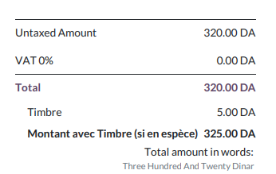
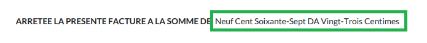
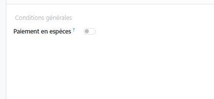
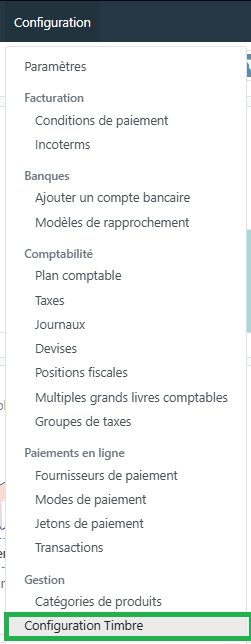

# Module Facturation

Ce document illustre les différentes fonctionnalités du module **Facturation** d'odoo 13 community.

## Présentation du module

Ce module est destiné à simplifier la facturation afin de se faire payés plus rapidement. Il permet de facturer automatiquement sur la base des bons de commandes, des commandes de livraison, des contrats ou des feuilles de frais générés. Odoo facturation permet aussi :

* d'acceptez les paiements en ligne.
* d'éliminez les soucis des rappels pour des paiements en retard.
* de simplifier la configuration du suivi automatique.
* de garder une trace des mouvements sur le compte en banque et sur le statut des factures.

## Configuration (admin)

Cette section, réservée aux **administrateurs** et **Gestionnaires des factures**, permet de définir les principaux paramètres relatifs à la facturation aux paiements et à la comptabilité.

#### Configuration des Taxes

La configuration des taxes permet de définir les paramètres relatifs aux **_taxes par défaut_** et à la **_méthode d'arrondi_**.

Pour les **_taxes par défaut_**, le **Gestionnaire des factures** peut ajouter celles qu'il utilise le plus fréquement en opérations de vente et d'achat.

#### Configuration des Devises

La configuration des **Devises** permet la devise principale utilisée. Si la société effectue des transactions avec d'autres devises, le paramètre **_Multidevises_** doit être activé.

#### Configuration des Factures Clients

Cette section permet de définit les paramètres relatifs aux factures clients, tel que les **_Options d'envoi par défaut_**, **_l'affichage du sous-total des lignes_**, les **_Termes et Conditions par défaut_**, les **_Avertissements lors de la facture de certains clients_** et les **_Arrondis lors du paiement en espèces_**.

### Conditions de paiement

Cette section permet de gérer les différentes catégories de conditions de paiements en fonction des délais alloués. Ces délais peuvent être associés à des échéances fixes ou à des paiements partiels en pourcentage.

### Taxes

Cette section permet de gérer les différentes catégories de taxes applicables à l'entreprise et de renseigner leurs paramètres comptables, tel que la base du calcul, la portée le motant, la répartition comptable, ...

### Position fiscale

Cette fonctionnalité est utile dans le cas où des régimes fiscaux spécifiques sont appliqués aux clients / fournisseurs (selon la localisation, exonérations à l'export, ...). Odoo permet aussi de définir des correspondances de taxes afin de les appliquer automatiquement en fonction de la position fiscale du client/fournisseur.

### Incoterms

Cette section permet de définir les catégories d'**Incoterms** utilisés par l'entreprise.

### Journaux

Cette section permet de gérer les différentes catégories de journaux utilisés pour l'enregistrement des opérations comptables.

### Ajouter un compte bancaire

Cette commande permet de créer un nouveau compte bancaire ainsi que le journal comptable qui lui est associé.

### Comptes bancaires

Cette section liste les différents journaux relatif aux comptes bancaires de l'entreprise.

### Intermédiaires de paiement

Cette section liste les différents types d'intermédiaires de paiement disponibles pour les opérations classiques (Virement bancaire, ...) ou enligne.

### Journal Groups

Cette section permet de définir les différentes catégories de groupes de journaux compatbles.

### Modèles de lettrage

Cette section permet de prédéfinir des pièces comptables afin de rapprocher facilement les pièces récurrentes comme les frais bancaires. Ces peuvent être fixes ou variables (ex : montant dépend du solde de notre compte en banque).

### Arrondis d'espèces

Cette section permet de définir des arrondis modèles réutilisables d'arrondis d'espèces.

## Clients (Menu)

Cette partie, qui de manière générale est automatiquement mise à jour par les modules **Ventes** et **Achats**, permet de gérer toutes les opérations de facturation client. Afin de l'exploiter il est indispensable de renseigner en premier la liste des clients de l'entreprise dans la section [Clients](#clients).

### Factures

Cette section permet de gérér les factures clients en renseigants toutes les informations nécessaires tel que la référence, la date, les conditions de paiement, les termes et les articles.

Cette facture, imprimable avec la commande **_Imprimer/Factures_**, progresse par plusieurs état qui sont : **_Brouillon_**, **_Comptabilisé_**.

### Avoirs

Cette section permet de gérér les avoirs (Notes de crédits) clients en renseigants toutes les informations nécessaires tel que la référence, la date, les conditions de paiement et les articles concernés avec leur libellé.

Cet avoir, imprimable avec la commande **_Imprimer/Factures_**, progresse par plusieurs état qui sont : **_Brouillon_**, **_Comptabilisé_**.

### Réceptions

Cette section permet de gérér les réceptions (Ticket de caisse) clients en renseigants toutes les informations nécessaires tel que la référence, la date, les conditions de paiement et les articles concernés avec leur libellé.

Cet avoir, imprimable avec la commande **_Imprimer/Factures_**, progresse par plusieurs état qui sont : **_Brouillon_**, **_Comptabilisé_**.

### Paiements

Cette section permet de gérér les paiements des clients en renseigants toutes les informations nécessaires tel que le type de paiement, la référence, la date, le montant et le journal compatable.

Ce paiement, imprimable avec la commande **_Imprimer/Factures_**, progresse par plusieurs état qui sont : **_Brouillon_**, **_Validé_**. Il peut aussi faire référence à un **_paiement lettré_** ou être annnulé.

De manière générale, les paiement sont automatiquement générés à partir des **factures**, **avoirs** ou des **réceptions** (Boutton **_enregistrer un paiement_**).

### Articles

Cette section permet de consulter les articles gérés par l'entreprise et **pouvant être vendus**. Pour plus d'informations, consulter le module [Stock / Article](./odoo-stock.mdx#articles).

### Clients

Cette section permet de gérer les informations relatives aux clients de l'entreprise (personnes / sociétés).

## Fournisseurs (Menu)

Cette section est similaire à celle des **Client** avec les différences suivantes :

* les **_Avoirs_** font référence à des **Remboursement**.
* les **_Réceptions_** font référence à des **Reçus d'achats**.
* les articles listés sont ceux **pouvant être achetés**.

## Fonctionnalités Algériennes

### Montant en Lettres — `amount_to_text_dz`

Ce module ajoute automatiquement le montant en toutes lettres (en français) en bas des documents imprimés suivants :

* **Factures clients** : `ARRETEE LA PRESENTE FACTURE A LA SOMME DE: ...`
* **Bons de commande** : `ARRETEE LA PRESENTE COMMANDE A LA SOMME DE: ...`
* **Devis / Facture Proforma** : `ARRETEE LE PRESENT DEVIS/FACTURE PROFORMA A LA SOMME DE: ...`

Le montant est converti automatiquement en français lors de l'impression du PDF, sans aucune action manuelle requise.

### Droit de Timbre Fiscal — `l10n_dz_timbre`

Ce module gère le calcul du **droit de timbre fiscal** conformément à la législation algérienne. Il s'applique uniquement aux **paiements en espèces**.

#### Activation du paiement en espèces

Sur le formulaire de la facture, un bouton toggle **Paiement en espèces** permet d'activer ou désactiver le timbre :

* **Activé** : le montant du timbre et le total avec timbre s'affichent sur la facture et dans le PDF imprimé.
* **Désactivé** : aucun timbre n'est appliqué (paiement par virement bancaire, CCP ou moyen électronique).

#### Logique de calcul

Le calcul du timbre dépend de la **date de la facture** :

**Avant le 01/01/2025 (ancienne logique)** — basée sur les paramètres configurés dans le système.

Accès : Menu Facturation → Configuration → Configuration Timbre

**À partir du 01/01/2025 (Loi de Finances 2025)** — barème progressif :

| Montant de la facture | Taux par tranche de 100 DA |
|---|---|
| Entre 300 DA et 30 000 DA | 1 DA |
| Entre 30 000 DA et 100 000 DA | 1,5 DA |
| Supérieur à 100 000 DA | 2 DA |

* Le montant minimum du timbre est de **5 DA**.
* Les paiements par **virement bancaire, postal ou électronique** sont **exonérés** du timbre (Article 258 du Code du timbre).

## Analyse

La partie analyse permet aux **Gestionnaires des factures** de visualiser des vues synthétiques de la situation de la facturation sous différentes formes : listes, tableau croisé, graphes.

## Workflow

---

## Plus de détails

- Pour la collaboration sur les formulaires de ce module, consulter la fonctionnalité [conversations](./odoo-conversations.mdx).
- [Site officiel d'odoo](https://www.odoo.com/fr_FR/page/billing).  

----
[Retour au sommaire](./odoo-deploy-guidelines.mdx)

----
🔗 **Official Resource**: [Odoo Documentation](https://www.odoo.com/documentation)