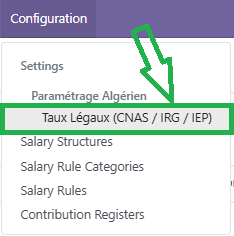
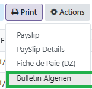
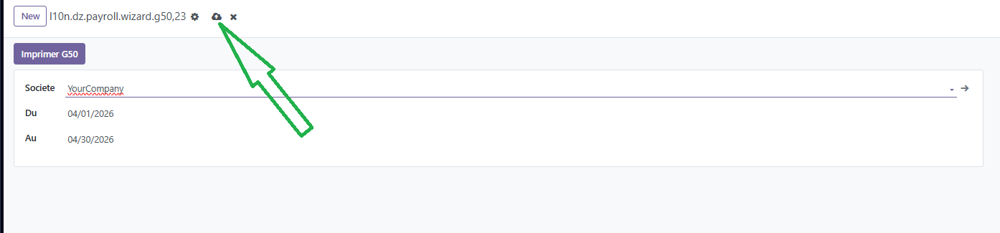
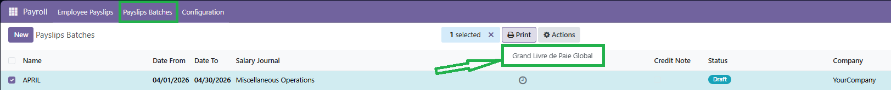

# Module Paie Algérienne (`l10n_dz_payroll`)

Ce document décrit les fonctionnalités du module de paie algérienne développé pour Odoo Community, couvrant les règles légales algériennes, la structure salariale, le bulletin de paie DZ et l'intégration comptable.

---

## Présentation du module

Le module `l10n_dz_payroll` (et son extension comptable `l10n_dz_payroll_account`) implémente la **réglementation algérienne de la paie** dans Odoo. Il prend en charge :

- La gestion des taux légaux (CNAS, IRG, IEP, SMIG...)
- La structure salariale préconfigurée avec les 30+ rubriques légales
- Le calcul automatique : Brut → CNAS → IRG → IEP → Net
- Le bulletin de paie au format DZ
- L'intégration comptable (écritures automatiques, G50, Grand Livre)

---

## Taux légaux algériens (`l10n.dz.hr.payroll.rate`)

Les taux légaux sont centralisés dans un enregistrement configurable par **période** (date début / date fin) et par **société**. Cela permet de gérer les évolutions réglementaires sans modifier le code.

**Accès :** Menu Paie → Configuration → Taux Légaux DZ




### SMIG

| Paramètre | Valeur par défaut |
|---|---|
| SMIG (DA/mois) | 20 000 DA |

### Cotisations CNAS

| Paramètre | Valeur |
|---|---|
| Taux CNAS Salarial | 9 % |
| Taux CNAS Patronal | 26 % |
| Plafond mensuel CNAS | 120 000 DA |

> La cotisation CNAS est calculée sur le **salaire brut plafonné**. Au-delà du plafond, aucune cotisation n'est prélevée.

### IRG — Impôt sur le Revenu Global

| Paramètre | Valeur |
|---|---|
| Abattement IRG | 40 % |
| Abattement minimum annuel | 12 000 DA |
| Abattement maximum annuel | 18 000 DA |
| Déduction conjoint (DA/mois) | 1 000 DA |
| Déduction par enfant (DA/mois) | 600 DA |

> La déduction conjoint ne s'applique que si l'option **Conjoint travaille** n'est **pas** cochée sur la fiche employé.

### Barème progressif IRG (2024)

| Tranche annuelle (DA) | Taux |
|---|---|
| 0 — 120 000 | 0 % (exonéré) |
| 120 001 — 360 000 | 20 % |
| 360 001 — 1 200 000 | 30 % |
| 1 200 001 — 3 600 000 | 33 % |
| Au-delà de 3 600 000 | 35 % |

> Les tranches sont **configurables** directement dans l'interface. En cas de modification législative, il suffit de créer un nouveau jeu de taux avec une nouvelle date de début.

### IEP — Indemnité d'Expérience Professionnelle

| Paramètre | Valeur |
|---|---|
| Taux IEP par année d'ancienneté | 1 % |
| Plafond IEP | 25 % |

> L'ancienneté est calculée automatiquement à partir de la **date de recrutement** renseignée sur le contrat.

### Indemnités forfaitaires légales

| Indemnité | Valeur |
|---|---|
| Transport (DA/mois) | 3 000 DA |
| Panier (DA/jour) | 120 DA |
| Allocations familiales | 2 % du SMIG par enfant |

---

## Structure salariale et règles de calcul

Le module fournit une **structure salariale DZ préconfigurée** qui s'applique automatiquement aux contrats algériens.

### Catégories de rubriques

Les rubriques sont classées en trois catégories selon leur traitement fiscal et social :

| Catégorie | CNAS | IRG | Exemples |
|---|---|---|---|
| **OUI CNAS / OUI IRG** | ✅ | ✅ | Salaire de poste, ITP, IFSP, Heures sup, PRI, PRC... |
| **NON CNAS / OUI IRG** | ❌ | ✅ | Indemnité retraite, Panier, Prime mariage... |
| **NON CNAS / NON IRG** | ❌ | ❌ | Indemnité décès, Scolarité, Frais mission, Zone géo... |

### Séquence de calcul automatique

Le calcul du bulletin suit la séquence légale algérienne :

```
1. Salaire Brut    = Salaire de poste + toutes rubriques OUI CNAS/OUI IRG
2. CNAS Salariale  = min(Brut, Plafond CNAS) × 9%
3. Net imposable   = Brut - CNAS + rubriques NON CNAS/OUI IRG
                     - Abattement IRG (40%, min/max)
                     - Déductions (conjoint + enfants)
4. IRG             = Barème progressif(Net imposable) — ou taux fixe si renseigné
5. IEP             = Salaire de poste × min(ancienneté × 1%, 25%)
6. Allocations     = Nb enfants × 2% × SMIG
7. Net à payer     = Brut + IEP + Allocations + rubriques exonérées
                     - CNAS Salariale - IRG
```

---

## Bulletin de paie format DZ

Le module génère un **bulletin de paie PDF au format algérien** unique, conforme aux usages légaux.

**Accès :** Menu Paie → Bulletins de Paie → Imprimer





Le bulletin inclut :
- Les informations de l'employé (matricule, N° CNAS, grade, poste)
- Le détail de toutes les rubriques avec leurs montants
- Le résumé des retenues (CNAS, IRG)
- Le net à payer

---

## Intégration Comptabilité (`l10n_dz_payroll_account`)

Le module `l10n_dz_payroll_account` étend la paie avec une intégration comptable complète, spécifique à la réglementation algérienne.

### Journal comptable PAIE

Un journal dédié **"PAIE"** est créé automatiquement et assigné par défaut aux contrats algériens. Toutes les écritures de paie sont regroupées dans ce journal pour faciliter le suivi.

### Écriture CNAS patronale automatique

À la **validation** d'un bulletin de paie, une écriture comptable automatique est générée pour la charge patronale CNAS (26 %) :

| Sens | Compte | Libellé |
|---|---|---|
| **Débit** | 631000 | Rémunérations du personnel |
| **Crédit** | 431000 | CNAS à payer |

> En cas de **refus** du bulletin, l'écriture CNAS patronale est automatiquement annulée (contre-passation propre).

### Déclaration G50

Le module propose un **wizard de génération de la déclaration G50**, regroupant les montants légaux à déclarer mensuellement.

**Accès :** Invoicing → Reporting → Déclaration G50


**Étapes :**
1. Sélectionner la période (date début / date fin)
2. Sélectionner la société
3. Cliquer sur **Générer G50**





Le rapport PDF récapitule pour la période :

| Ligne G50 | Contenu |
|---|---|
| IRG retenu | Total IRG prélevé sur les salariés |
| CNAS Salariale | Total cotisations part salariale (9 %) |
| CNAS Patronale | Total cotisations part patronale (26 %) |
| Total CNAS | CNAS sal + CNAS pat |
| Nombre de salariés | Bulletins validés sur la période |


### Grand Livre de Paie Global

Le **Grand Livre de Paie** consolide l'ensemble des écritures de paie de tous les salariés, permettant une vision globale de la masse salariale pour une période donnée.

**Accès :** Payslips Batches → Rapports → Grand Livre de Paie





## Récapitulatif des fonctionnalités

| Fonctionnalité | Module |
|---|---|
| Taux légaux CNAS / IRG / IEP configurables | `l10n_dz_payroll` |
| Structure salariale DZ préconfigurée (30+ rubriques) | `l10n_dz_payroll` |
| Calcul automatique Brut → Net (barème progressif ou taux fixe) | `l10n_dz_payroll` |
| Bulletin de paie PDF format DZ | `l10n_dz_payroll` |
| Attestation de travail et de salaire | `l10n_dz_payroll` |
| Journal PAIE dédié | `l10n_dz_payroll_account` |
| Écriture automatique CNAS patronale (631000 / 431000) | `l10n_dz_payroll_account` |
| Déclaration G50 (wizard + PDF) | `l10n_dz_payroll_account` |
| Grand Livre de Paie Global | `l10n_dz_payroll_account` |


---

🔗 **Référence légale :** [Code du Travail Algérien](https://www.joradp.dz) · [CNAS](https://www.cnas.dz)